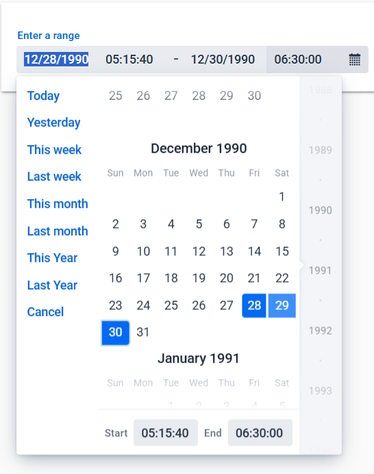

[](https://www.npmjs.com/package/@vaadin-component-factory/vcf-date-time-range-picker)

# &lt;vcf-date-time-range-picker&gt;

Web Component providing a date-time range selection field which includes a scrollable month calendar view and start and end time pickers.

Implementation is based on [&lt;vcf-date-range-picker&gt;](https://github.com/vaadin-component-factory/vcf-date-range-picker).

This component is part of Vaadin Component Factory.



## How to use

```html
<vcf-date-time-range-picker label="Enter a range" value="1990-12-28T05:15:40;1990-12-30T06:30"></vcf-date-time-range-picker>
```

## Running demo

1. Fork the `vcf-date-time-range-picker` repository and clone it locally.

2. Make sure you have [npm](https://www.npmjs.com/) installed.

3. When in the `vcf-date-time-range-picker` directory, run `npm install` to install dependencies.

4. Run `npm start` to open the demo.

## Contributing

To contribute to the component, please read [the guideline](https://github.com/vaadin/vaadin-core/blob/master/CONTRIBUTING.md) first.

## License

Distributed under Apache Licence 2.0

Date Time Range Picker Web Component is written by Vaadin Ltd.

### Sponsored development
Major pieces of development of this add-on has been sponsored by multiple customers of Vaadin. Read more about Expert on Demand at: [Support](https://vaadin.com/support) and [Pricing](https://vaadin.com/pricing).
